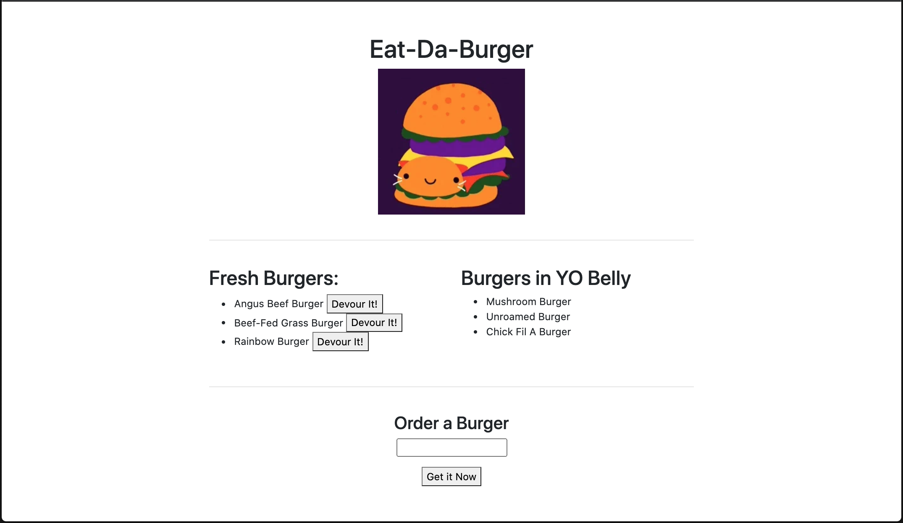

# Node Express Handlebars

## Description

A burger logger has been created with MySQL, Node, Express, Handlebars and a homemade ORM. This application follows the Model View Controller (MVC) design pattern. Node and MySQL are used to query and route data, and Handlebars to generate HTML.

This application is deployed to Heroku.

## View Application:

* [Heroku Link](#)

## Functionality

* Eat-Da-Burger is a restaurant app that lets users input the name of burgers they'd like to eat.

* Whenever a user submits a burger's name, the app will display the burger on the left side of the page with a button titled "Devour It" which allows the user to devour the burger.

* The app will store every burger in a database, whether devoured or not.
